---
aliases:
- people-us
layout: page
description: People of the Society for Open, Reliable, and Transparent Ecology and Evolutionary Biology (SORTEE)
title: People
---

&nbsp;

---

## Committees:   

* [Board]()   
* [Executive Committee]()   
* [Advocacy]()   
* [Awards]()   
* [Budget]()   
* [Conference]()   
* [Diversity, Equity, and Inclusion]()   
* [EcoEvoRxiv Committee]() 
* [Education and Outreach]()   
* [Fundraising]()  
* [Media]()   
* [Member Engagement Committee]()   
* [Senior Advisory Board]()   
* [Past Board Members]()    

&nbsp;
&nbsp;
&nbsp;

---

### Annual Reports on Committee Activities:    

* [2021 Annual Report](https://osf.io/eb4ph)   
* [2022 Annual Report](https://osf.io/va7eq)     
* [2023 Annual Report](https://osf.io/5s2xc)     
* [2024 Annual Report](https://osf.io/gsw6x)     

&nbsp;

---

### Board of Directors      

This is an elected committee that is ultimately responsible for SORTEE. Three positions on the board come open each year and are elected by the members of SORTEE in November. These terms last for three (3) years.    

&nbsp;   

**Members serving from 2025 through 2027 are:**  

&nbsp;  

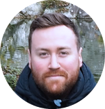  
[Michael Bertram (he/him)](https://www.michaelbertramlab.org) is an Assistant Professor at the Swedish University of Agricultural Sciences, where he investigates the impacts of human-induced environmental change on wildlife populations.

&nbsp;  

  
[Stephanie Flaman]() is a MSc student at the University of Regina in conjunction with Agriculture and Agri-Food Canada.  

&nbsp;  

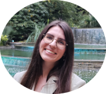  
[Marija Purgar](https://www.irb.hr/eng/About-RBI/People/Marija-Purgar-Filjak) **(President-Elect)** is a PhD student in Oceanology at the Faculty of Science and a research assistant at the Ruđer Bošković Institute, Zagreb.  

&nbsp;   

**Members serving from 2024 through 2026 are:**       

&nbsp;  

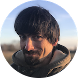  
[Matthieu Paquet, (he/him)](https://sete-moulis-cnrs.fr/fr/recherches/change/equipe/item/1169-paquet-matthieu) is a researcher working on behavioural ecology and population dynamics at the Theoretical and Experimental Ecology Station (SETE,CNRS).  

&nbsp;

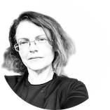  
[Malgorzata (Losia) Lagisz (she/her)](https://mlagisz.weebly.com/) is a Research Fellow at the University of New South Wales Sydney, where she works on meta-research and evidence synthesis.

&nbsp;  

**Members serving from 2023 through 2025 are:**       

&nbsp;  

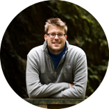  
[Ed Ivimey-Cook (he/him)](https://eivimeycook.github.io/) **(President)** is a post-doctoral researcher at the University of Glasgow.   
&nbsp;  

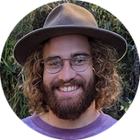  
[Patrice Pottier](http://www.i-deel.org/patrice-pottier.html) is a PhD student at the University of New South Wales.  
&nbsp;

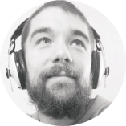  
[Alfredo Sánchez Tójar](https://www.uni-bielefeld.de/fakultaeten/biologie/forschung/arbeitsgruppen/evo_biology/team/tojar/) is a researcher at Bielefeld University, where he focuses on evidence synthesis and meta-research in ecology and evolution.

&nbsp;  

**Members serving from 2022 through 2024 are:**       

&nbsp;   

   
[Kaija Gahm](http://kaijagahm.netlify.app/) **(Secretary)** is a PhD student at UCLA, studying spatiotemporal dynamics of vulture social networks in the Pinter-Wollman lab.   
&nbsp;

   
[Alexa Fredston](https://www.alexafredston.com/) **(Treasurer)** is a quantitative ecologist and Assistant Professor at the University of California Santa Cruz.   

&nbsp;
&nbsp;
&nbsp;

---

### Executive Committee       
As specified in the [SORTEE bylaws](https://www.sortee.org/bylaws/), the Executive Committee is chosen by the Board of Directors.

Current officers are:
&nbsp;

[Ed Ivimey-Cook (he/him), *University of Glasgow, UK*](https://eivimeycook.github.io/)  **(President)**    
[Marija Purgar](https://www.irb.hr/eng/About-RBI/People/Marija-Purgar-Filjak) **(President-Elect)**  
[Rose O’Dea](https://www.roseodea.com/) **(Past President)**    
[Alexa Fredston](https://www.alexafredston.com/) **(Treasurer)**  
[Kaija Gahm](http://kaijagahm.netlify.app/) **(Secretary)**   

&nbsp;
&nbsp;
&nbsp;

---

### Advocacy Committee   

The Advocacy committee will develop policy statements and propose advocacy projects for improving the openness, reliability, and transparency of research in ecology and evolutionary biology.     

Current members are: 

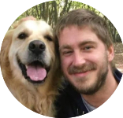    
**Chair:** [Joel Pick (he/him), *University of Edinburgh, UK*](mailto:joel.l.pick@gmail.com) ([Website](https://joelpick.github.io))  
  
Christian John (he/him), *University of California, USA*   
[Ed Ivimey-Cook (he/him), *University of Glasgow, UK*](https://eivimeycook.github.io/)  
Julia Sharapi (she/her), *Stanford University, USA*  
Kevin Bairos-Novak  
Leyla Cabugos (she/her), *California Polytechnic State University, USA*    
Marija Purgar  
Sarah Hasnain (no pronouns), *Sorbonne University, France*  
Shinichi Nakagawa (he/him), *University of Alberta, Canada*  

&nbsp;
&nbsp;
&nbsp;

---

### Awards Committee  

The awards committee is responsible for managing the SORTEE awards program [https://www.sortee.org/awards/](http://www.sortee.org/awards/).  

Current members are: 
 
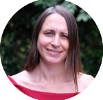    
**Chair:** [Hannah Dugdale](mailto:h.l.dugdale@rug.nl)	([Website](https://hannahdugdale.wordpress.com/))  
  
Elina Takola  
[Malgorzata (Losia) Lagisz (she/her), *The University of New South Wales, Australia; University of Alberta, Canada*](https://mlagisz.weebly.com/)  
[Sandra Hamel  (she/her), *Université Laval, Canada*](https://sandra-hamel.fsg.ulaval.ca/)  

&nbsp;
&nbsp;
&nbsp;

---

### Budget Committee  		

The Budget Committee reviews and approves [funding requests](https://docs.google.com/forms/d/e/1FAIpQLSdY7gi-pNRSJPZaFnV9WpS4L28ZNgHQ3zwLh43YG7-WHUL87g/viewform).  

Current members are:  

Alexa Fredston  
Kaija Gahm  
Tim Parker          
[Ed Ivimey-Cook (he/him), *University of Glasgow, UK*](https://github.com/EIvimeyCook)  
[Malgorzata (Losia) Lagisz (she/her), *The University of New South Wales, Australia; University of Alberta, Canada*](https://mlagisz.weebly.com/)    

&nbsp;
&nbsp;
&nbsp;

---

### Conference Committee	 

The Conference committee organizes the virtual SORTEE Conference, held in October.    

Current members are:   

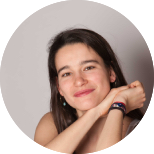    
**Chair:** [Juliette Tariel-Adam (she/her), *Macquarie University, Australia*](mailto:juliette.tarieladam@gmail.com) ([Website](https://juliettetarieladam.com/))  
  
Anita Tarandek (she/her), *Ruđer Bošković Institute, Croatia*       
[Ineta Kačergytė (she/her), *Department of Ecology, Swedish University of Agricultural Sciences, Sweden*](https://www.slu.se/en/profilepages/k/ineta-kacergyte/)        
Magdalena Wutkowska    
Marija Purgar      
Sofia Paraskevopoulou (she/her), *University of Lund, Sweden*      
Stephanie Flaman      

&nbsp;
&nbsp;
&nbsp;

---

### Diversity, Equity, and Inclusion Committee	 

The Diversity, Equity, and Inclusion Committee promotes diversity, equity, and inclusion within SORTEE’s activities and committees.    

Current members are:   
  
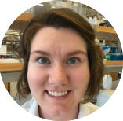  
**Co-Chair:** [Brooke Long-Fox (she/her/hers), *MorphoBank, Phoenix Bioinformatics; South Dakota School of Mines and Technology, USA*](mailto:blongfox@morphobank.org)  
  
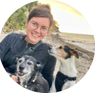  
**Co-Chair:** [Friederike (freddy) Hillemann](mailto:f.hillemann@web.de) ([Website](https://fhillemann.github.io/))  
  
[Charlotte Recapet (they/them), *Université Pau Pays de l'Adour, France*](https://recherche.univ-pau.fr/en/pagesperso/cv_en_-crecapet-en.html)  
[Elvira D'Bastiani (she/her), *University of California, USA*](https://www.elviradbastiani.com)    
Frigg Speelman   
Manasee Weerathunga  
Sarah Hasnain (no pronouns), *Sorbonne University, France*    
Sofia Paraskevopoulou  
Suz Everingham  
Mark Young  

&nbsp;
&nbsp;
&nbsp;

---

### EcoEvoRxiv Committee
[EcoEvoRxiv](https://ecoevorxiv.org/) (EcoEvo“archive”) is a not-for-profit subject-matter specific research repository for works related to ecology, evolution and conservation and is the official preprint server of SORTEE.    

Current members are:   
  
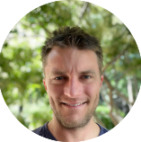  
**Co-Chair:** [Daniel Noble (he/him), *The Australian National University, Australia*](mailto:daniel.noble@anu.edu.au) ([Website](https://nobledan.com))  
  
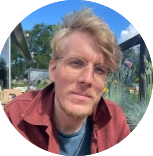    
**Co-Chair:** [Stefan Vriend (he/him), *Netherlands Institute of Ecology (NIOO-KNAW), The Netherlands*](mailto:svriend@gmail.com) ([Website](https://nioo.knaw.nl/en/employees/stefan-vriend))  
  
[Birgit Szabo (they/them), *Gent University, Belgium*](https://birgitszabo.wixsite.com/cogsciresearch)  
[Elvira D'Bastiani (she/her), *University of California, USA*](https://www.elviradbastiani.com)    
Félicie Dhellemmes  
Jenna Braun  
Mark Young  
Marta Acácio  
Melina de Souza Leite  
[Nicholas Wu, *Murdoch University, Australia*](mailto:nicholas.wu.nz@gmail.com)  
Niladri Mondal (he/him), *Katholic University at Leuven, Belgium*    
Pablo Recio Santiago  
[Yseult Héjja-Brichard (she/they), *University of Veterinary Medicine in Vienna, Austria; University of Vienna, Austria*](https://yseulthb.github.io/)  
Brooke Long-Fox (she/her/hers), *MorphoBank, Phoenix Bioinformatics; South Dakota School of Mines and Technology, USA*   

&nbsp;
&nbsp;
&nbsp;

---

### Education and Outreach Committee   

The Education & Outreach committee provides educational resources to individuals and organizations interested in learning more about improving research by making it more open, reliable, and transparent.    

Current members are:   
    
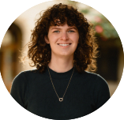      
**Chair:** [Saoirse Kelleher (she/her), *University of Melbourne, Australia*](mailto:saoirse.kelleher@student.unimelb.edu.au) ([Website](https://saoirsekelleher.eco))    
  
Elizabeth Hrycyna  
Giulia Masoero (she/her), *Swiss Ornithological Institute, Switzerland*   
Leonardo Capitani, *Swiss Federal Institute of Aquatic Science and Technology, Switzerland*    
Leveda Cheng   
Nusrath Jahan Emu   
Philip Ogbevire  
Zuzanna Zagrodzka     

&nbsp;
&nbsp;
&nbsp;

---

### Fundraising Committee	 

The Fundraising committee develops and implements plans for raising funds to support SORTEE.    

Current members are:   
 
  
  
**Chair:** [Matthieu Paquet (he/him)](mailto:matthieu.paquet@outlook.com) ([Website](https://sete-moulis-cnrs.fr/fr/recherches/change/equipe/item/1169-paquet-matthieu))  
  
Aidan Tan  
Dominique Roche  
Michael Bertram (he/him), *Swedish University of Agricultural Sciences, Sweden*  
[Ruby Krasnow (she/her), *University of Maine, US*](https://ruby.science)    
Snata Chakraborty  
Barbara Class  (she/her), *National Research Institute for Agriculture, Food and Environment (INRAE), France*  

&nbsp;
&nbsp;
&nbsp;

---

### Media Committee  		

The Media committee develops content (for the website, social media, and newsletter), designs and maintains the website, and develops new ideas for spreading the word about SORTEE and open, reliable, and transparent science.    

Current members are:  
 
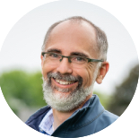  
  
**Chair:** [Tim Parker](mailto:mailto:parkerth@whitman.edu) ([Website](http://people.whitman.edu/~parkerth/))  
  
Alfredo Sánchez-Tójar  
Caleb Onoja Akogwu  
Gabe Winter  
[Malgorzata (Losia) Lagisz (she/her), *The University of New South Wales, Australia; University of Alberta, Canada*](https://mlagisz.weebly.com/)     
Manasee Weerathunga  
Oakleigh Wilson  
Swastika Issar  
[July Pilowsky (they/he/she), *Cary Institute of Ecosystem Studies, USA*](https://pilowsky.me)  

&nbsp;
&nbsp;
&nbsp;

---

### Member Engagement Committee  		

The Member Engagement Committee oversees opportunities for SORTEE members to interact throughout the year. The motivation behind starting this committee is to increase the benefits of SORTEE membership (e.g., camaraderie and the opportunity to join collaborative projects).   

Current members are:   

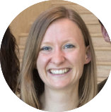  
  
**Chair:** [Natalie van Dis](mailto:natalie.vandis@helsinki.fi) ([Website](https://scholar.google.com/citations?user=UTC6iJMAAAAJ&hl=en))  
  
[Cecilia Baldoni](https://cecibaldoni.github.io/)  
Charlotte Recapet  
Corné de Groot  
[Malgorzata (Losia) Lagisz (she/her), *The University of New South Wales, Australia; University of Alberta, Canada*](https://mlagisz.weebly.com/)     
Rachel Turba  

&nbsp;
&nbsp;
&nbsp;

---

### Senior Advisory Board   		

The purpose of the SAB is to provide senior counsel and advice to SORTEE leadership (Officers, Directors, and Chairs), and to facilitate strategic connections with related organizations and individuals. The Terms of Reference for the Senior Advisory Board can be found [here](https://docs.google.com/document/d/1vCXOde3pGuBl6CJC3LQQ7mehboeb_2SSF-ABTuXxd0M/). 

Current members are:   

Allen Moore  
Ben Sheldon   
Bob Montgomerie     
Bob Wong     
Fiona Fidler     
Julia Koricheva     
Klaus Reinhold     
Loeske Kruuk     
Mark Burgman     
Michael Jennions     
Nicolas Galtier     
Richard McElreath     
Tracey Chapman   
William Sutherland     

&nbsp;
&nbsp;
&nbsp;

---

### Past Board Members  

Please see [this page]().   

&nbsp;
