---
aliases:
- people-us
layout: people
description: People of the Society for Open, Reliable, and Transparent Ecology and Evolutionary Biology (SORTEE)
title: People
editor_options: 
  markdown: 
    wrap: 72
---

 

------------------------------------------------------------------------

## Committees:

-   [Board]()  
-   [Executive Committee]()  
-   [Advocacy]()  
-   [Awards]()  
-   [Budget]()  
-   [Conference]()  
-   [Diversity, Equity, and
    Inclusion]()  
-   [EcoEvoRxiv Committee]()
-   [Education and
    Outreach]()  
-   [Fundraising]()  
-   [Media]()  
-   [Member Engagement
    Committee]()  
-   [Senior Advisory Board]()  
-   [Past Board Members]()

     

------------------------------------------------------------------------

### Annual Reports on Committee Activities:

-   [2021 Annual Report](https://osf.io/eb4ph)  
-   [2022 Annual Report](https://osf.io/va7eq)  
-   [2023 Annual Report](https://osf.io/5s2xc)  
-   [2024 Annual Report](https://osf.io/gsw6x)
-   [2025 Annual Report](https://osf.io/6yzxb/files/rzcbv)

 

------------------------------------------------------------------------

### Board of Directors

This is an elected committee that is ultimately responsible for SORTEE.
Three positions on the board come open each year and are elected by the
members of SORTEE in November. These terms last for three (3) years.

 
 

**Members serving from 2026 through 2028 are:**

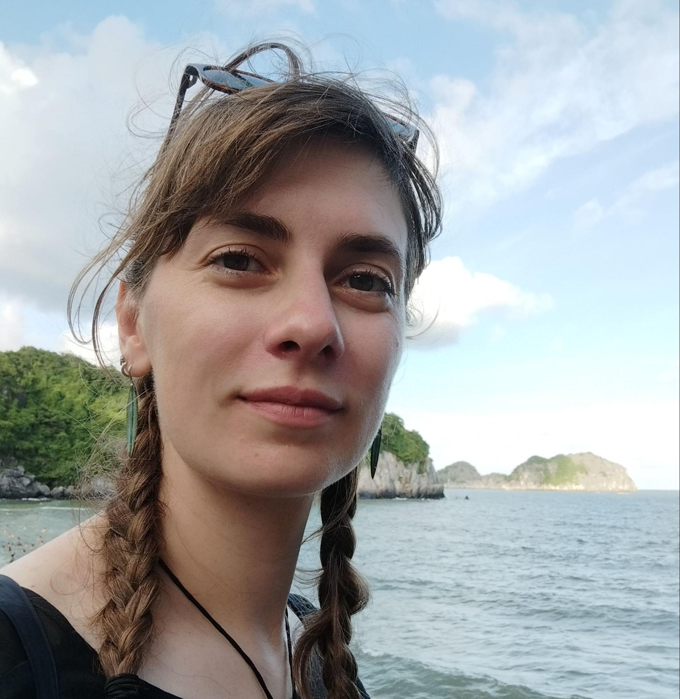  
Ineta Kačergytė (she/her)
([Website](https://www.slu.se/en/profilepages/k/ineta-kacergyte/)) is a
postdoctoral researcher at the Swedish University of Agricultural
Sciences, where Ineta evaluates conservation efforts to restore wetlands
for biodiversity.

 

  
Aidan Tan
([Website](https://www.sydney.edu.au/medicine-health/about/our-people/academic-staff/aidan-tan.html))
is a paediatric doctor, governance leader and long-time advocate for
open, reliable and transparent science who cares deeply about
strengthening SORTEE's global community through principled, inclusive
and accountable research culture.

 

  
Juliette Tariel-Adam (she/they)
([Website](https://juliettetarieladam.com)) is a postdoctoral researcher
interested in the evolution of fish behaviour. Juliette currently works
on tool use by fishes ([project website](https://fishtooluse.com))
remotely with Macquarie University.

 
 

**Members serving from 2025 through 2027 are:**  

&nbsp;  

  
Michael Bertram (he/him) ([Website](https://www.michaelbertramlab.org)) is an Assistant Professor at the Swedish University of Agricultural Sciences, where he investigates the impacts of human-induced environmental change on wildlife populations.

&nbsp;  

  
Stephanie Flaman is a MSc student at the University of Regina in conjunction with Agriculture and Agri-Food Canada.  

&nbsp;  

  
Marija Purgar ([Website](https://www.irb.hr/eng/About-RBI/People/Marija-Purgar-Filjak)) is a PhD student in Oceanology at the Faculty of Science and a research assistant at the Ruđer Bošković Institute, Zagreb.  

 
 

**Members serving from 2024 through 2026 are:**  

  
Matthieu Paquet, (he/him) ([Website](https://sete-moulis-cnrs.fr/fr/recherches/change/equipe/item/1169-paquet-matthieu)) is a researcher working on behavioural ecology and population dynamics at the Theoretical and Experimental Ecology Station (SETE,CNRS).  

 Malgorzata (Losia) Lagisz
(she/her) ([Website](https://mlagisz.weebly.com/) and
[Labwebsite](https://i-deel.org/)) is an Associate Professor at the
University of Alberta in Canada, where she works on meta-research and
evidence synthesis.

------------------------------------------------------------------------

### Executive Committee

As specified in the [SORTEE bylaws](https://www.sortee.org/bylaws/), the
Executive Committee is chosen by the Board of Directors.

Current officers are:  

Marija Purgar (she/her) **(President)**  

Malgorzata (Losia) Lagisz (she/her) **(President-Elect)** ([Website](https://mlagisz.weebly.com/))  

Ed Ivimey-Cook (he/him) **(Past-President)** ([Website](https://eivimeycook.github.io/))   

Christian John (he/him) **(Treasurer)** ([Website](https://jepsonnomad.github.io/))   

Matthieu Paquet (he/him) **(Secretary)** ([Website](https://sete-moulis-cnrs.fr/fr/recherches/change/equipe/item/1169-paquet-matthieu))  

     

------------------------------------------------------------------------

### Advocacy Committee

The Advocacy committee will develop policy statements and propose
advocacy projects for improving the openness, reliability, and
transparency of research in ecology and evolutionary biology.

Current members are:

  
**Co-Chair:** Joel Pick (he/him), *University of Edinburgh, UK*
([Contact](mailto:joel.l.pick@gmail.com) -
[Website](https://joelpick.github.io))

 **Co-Chair:** Ed Ivimey-Cook
(he/him), *University of Glasgow, UK*
([Website](https://eivimeycook.github.io/))

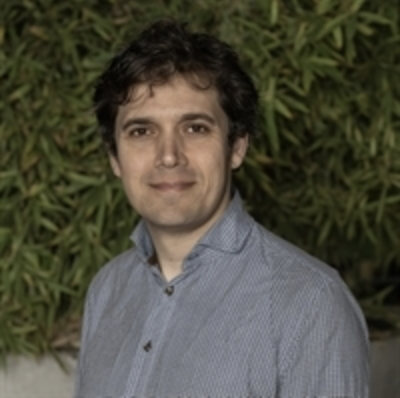 Ben Auxier (he/him) *Wageningen University
and Research, Netherlands*
([Website](https://benauxier.github.io/auxierlab/home/))

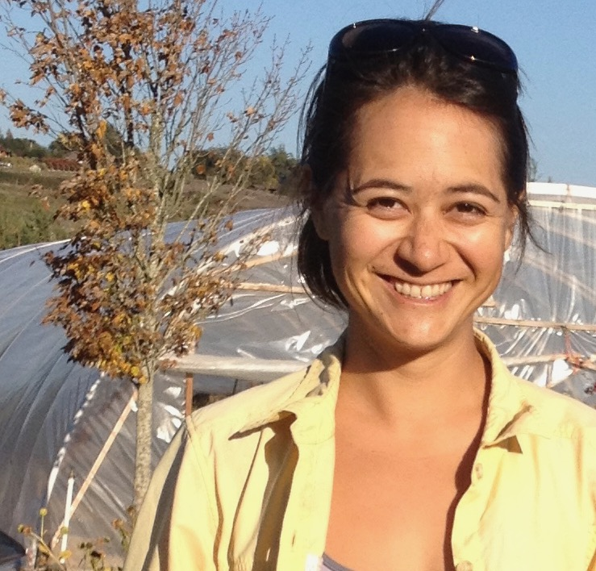 Leyla Cabugos, *California
Polytechnic State University, USA*

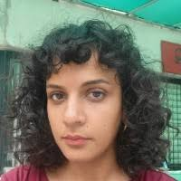 Sarah Hasnain (no preference),
*Laboratoire d'Océanographie de Villefranche, Sorbonne University,
France* ([Website](https://www.sarahhasnain.com/))

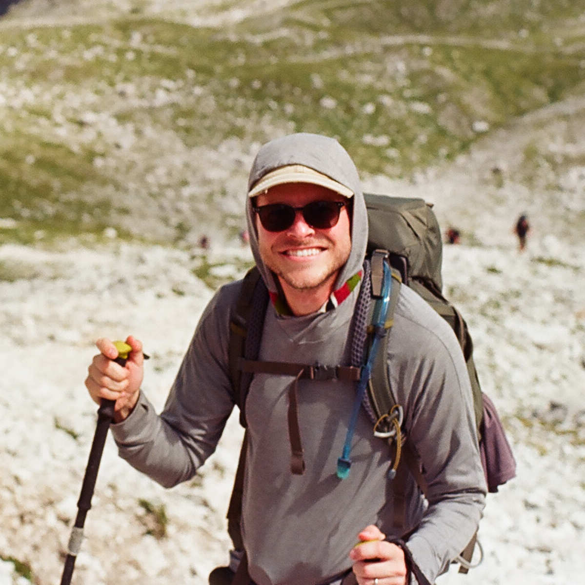 Christian John (he/him),
*University of California, USA*
 ([Website](https://jepsonnomad.github.io/))

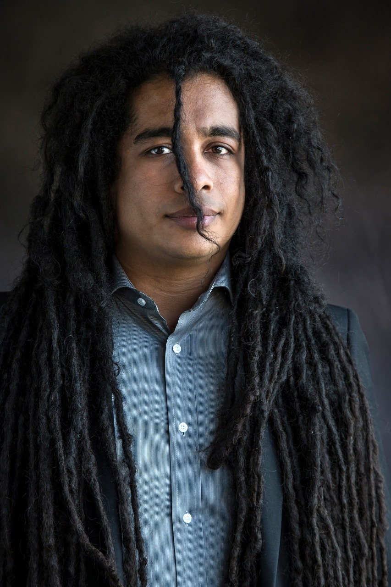 César Marín (he/him), *Universidad Santo
Tomás, Chile* ([Website](https://cesar-marin.com/))

 Shinichi Nakagawa (he/him),
*University of Alberta, Canada & Collaboration for Open Science and
Synthesis in Ecology and Evolution (COSSEE)*
([Website](https://www.cossee.org/index.html))

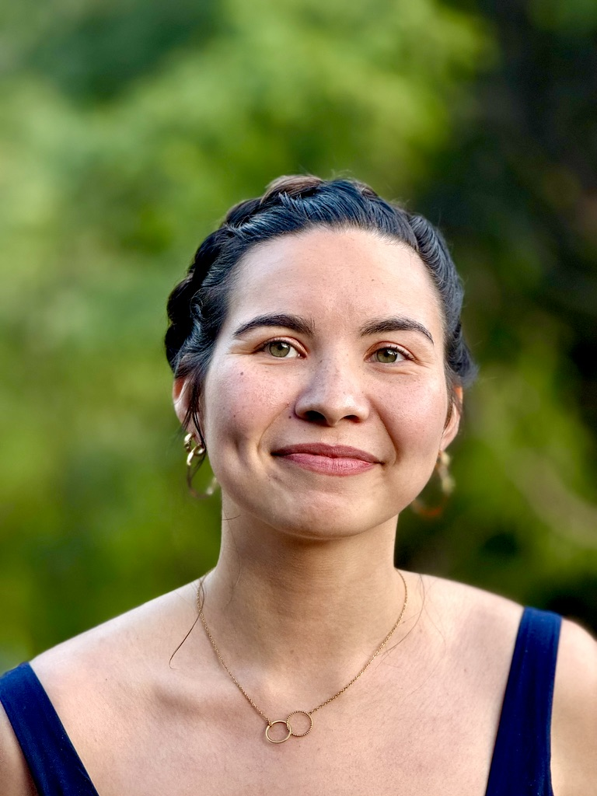 Julia Sharapi (she/her), *Stanford
University, USA*

     

------------------------------------------------------------------------

### Awards Committee

The awards committee is responsible for managing the SORTEE awards
program [https://www.sortee.org/awards/](http://www.sortee.org/awards/).

Current members are:

  
**Chair:** Marija Purgar (she/her), *University of Alberta, Canada*

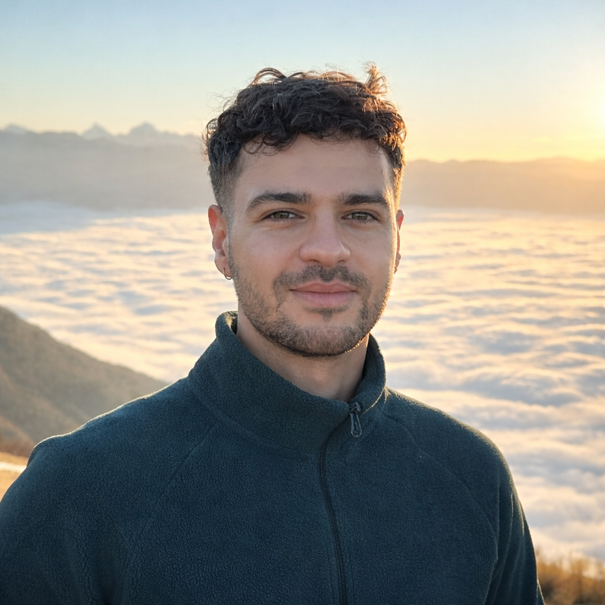
Heikel BALTI (he/him), *Marie & Louis Pasteur University, CNRS, France*
([Website](https://www.researchgate.net/profile/Heikel-Balti))

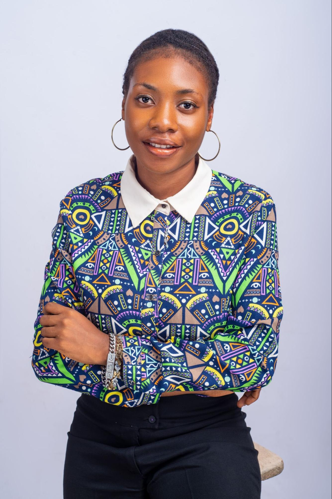
Abuoma Ejikeme (she/her), *Department of Biomedical Laboratory Science,
University of Ibadan, Nigeria*

Sandra Hamel (she/her), *Université Laval, Canada*
([Website](https://sandra-hamel.fsg.ulaval.ca/)) 

Malgorzata (Losia) Lagisz (she/her), *University of Alberta in Canada*
([Website](https://mlagisz.weebly.com/) and
[Labwebsite](https://i-deel.org/))

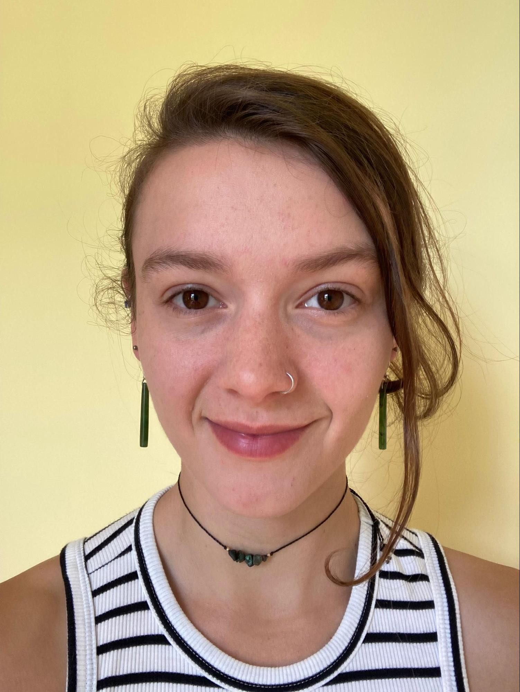
Frigg Speelman (she/her), *Max Planck Institute of Animal Behavior,
Germany* ([Website](https://fjdspeelman.owlstown.net/))

   

------------------------------------------------------------------------

### Budget Committee

The Budget Committee reviews and approves [funding
requests](https://docs.google.com/forms/d/e/1FAIpQLSdY7gi-pNRSJPZaFnV9WpS4L28ZNgHQ3zwLh43YG7-WHUL87g/viewform).

Current members are:

Ed Ivimey Cook

Christian John

Malgorzata (Losia) Lagisz

Matthieu Paquet

Tim Parker

Marija Purgar

     

------------------------------------------------------------------------

### Conference Committee

The Conference committee organizes the virtual SORTEE Conference, held
in October.

Current members are:

 
**Chair:** Stephanie Flaman,
*University of Regina, Canada*

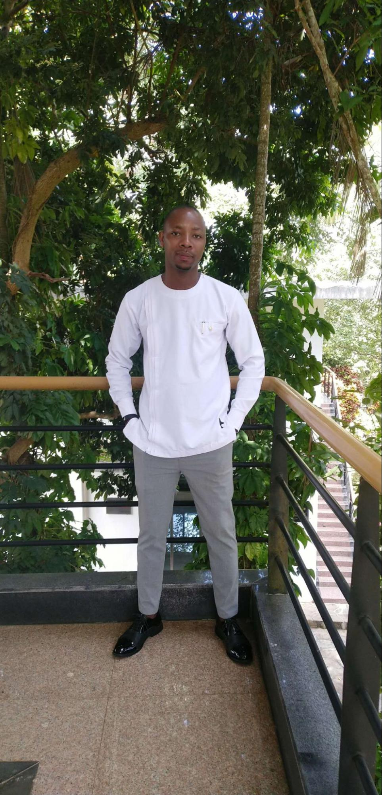 Munyaneza Aphrodis,
*Xishuangbanna Tropical Botanical Garden, Chinese Academy of Sciences,
Yunnan, China*

 Abuoma Ejikeme (she/her),
*Department of Biomedical Laboratory Science, University of Ibadan,
Nigeria*

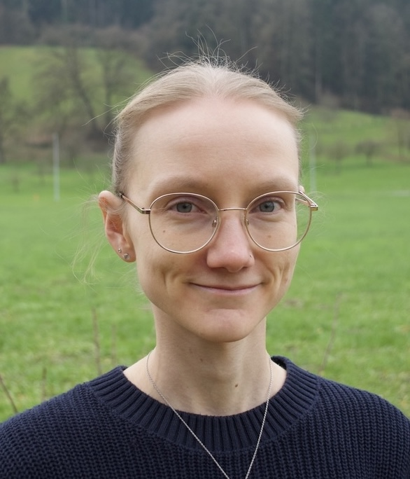 Lara Hinninger, (she/her),
*University of Zurich, Switzerland*

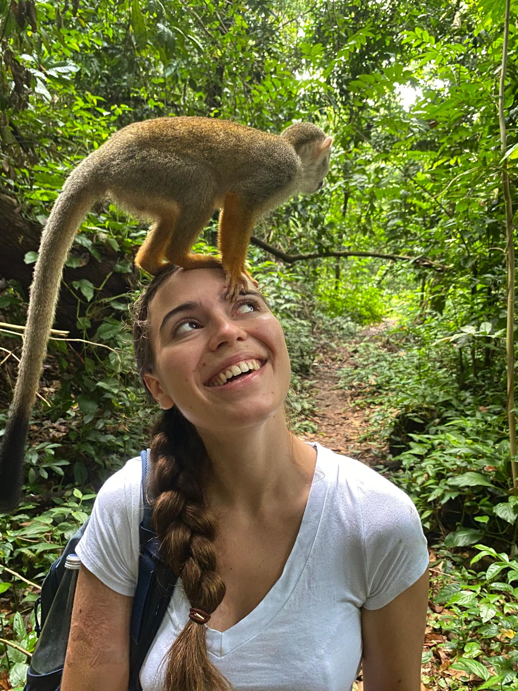 Lise Layotte (she/her), *Norwegian
University of Life Sciences (NMBU), Norway*

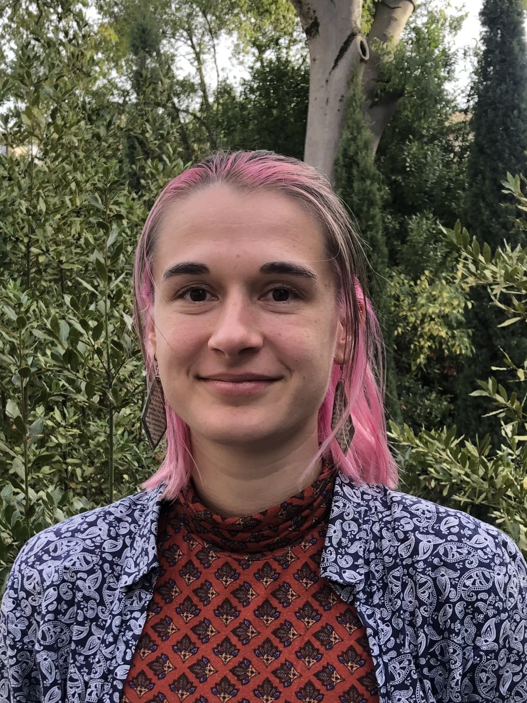 Lisa Nicvert (she/her),
[FRB-CESAB](https://www.fondationbiodiversite.fr/en/the-frb-in-action/programs-and-projects/le-cesab/)
([DRAGON](https://www.fondationbiodiversite.fr/en/the-frb-in-action/programs-and-projects/le-cesab/dragon/)
project), *Montpellier (France)*.
[Website](https://lisanicvert.github.io/)

  
Juliette Tariel-Adam (she/they), *Macquarie University, Australia*
([Website](https://juliettetarieladam.com)).

 Magdalena Wutkowska
(she/her) *Institute of Soil Biology and Biogeochemistry Biology Centre,
Czech Academy of Sciences, Czechia*

     

------------------------------------------------------------------------

### Diversity, Equity, and Inclusion Committee

The Diversity, Equity, and Inclusion Committee promotes diversity,
equity, and inclusion within SORTEE's activities and committees.

Current members are:

  
**Co-Chair:** Brooke Long-Fox (she/her/hers), *MorphoBank, Phoenix
Bioinformatics, USA* ([Contact](mailto:blongfox@morphobank.org))

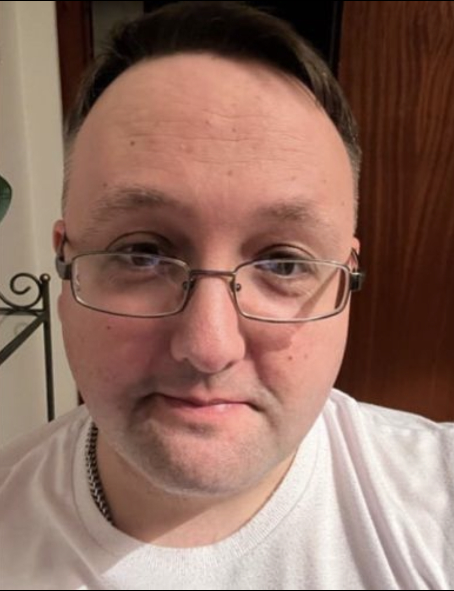 **Co-Chair:** Mark Young (he/they) *School
of Biological Sciences, University of Southampton, UK*
([Website](https://sites.google.com/view/drmarkyoung))

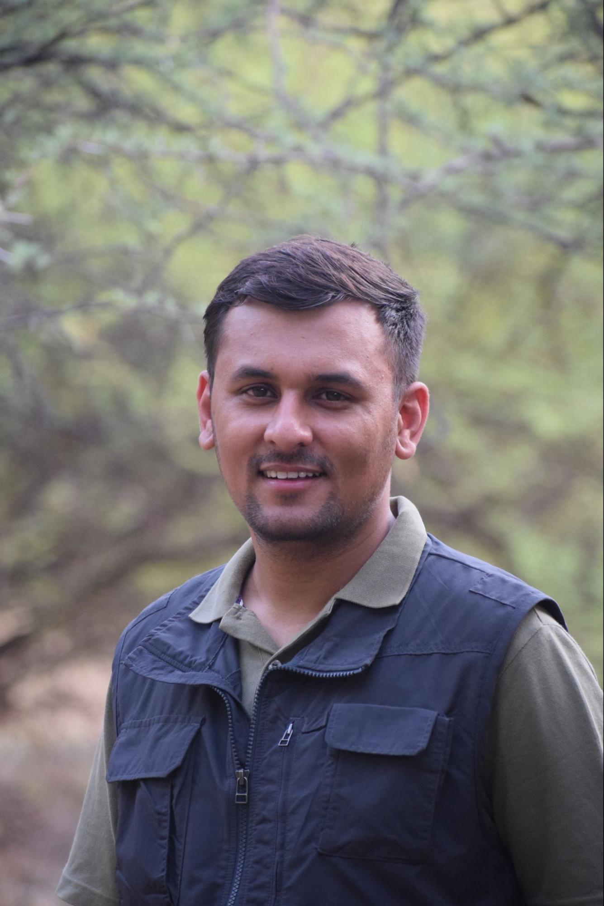 Rounak Choudhary, *Maharshi
Dayanand Saraswati University, Rajasthan, India*
([Website](https://www.tharlab.in/rounakchoudhary))

 Sarah Hasnain (no preference),
*Laboratoire d'Océanographie de Villefranche, Sorbonne University,
France* ([Website](https://www.sarahhasnain.com/))

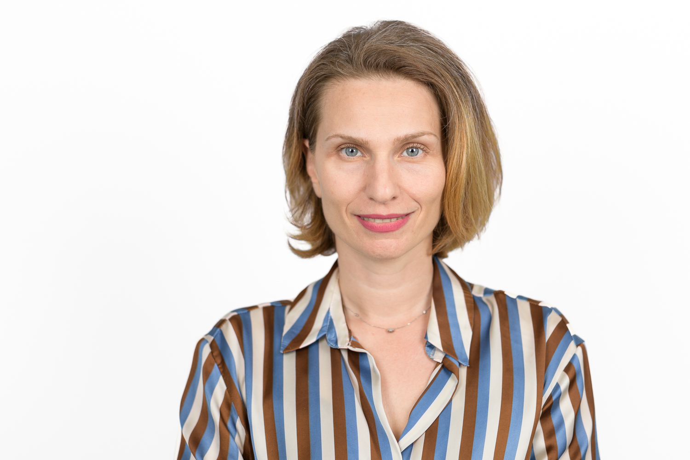 Sofia
Paraskevopoulou (she/her), *Dep of Cell and Molecular Biology, Uppsala
University, Sweden* ([Website](http://sofiapar-ecoevo.de/))

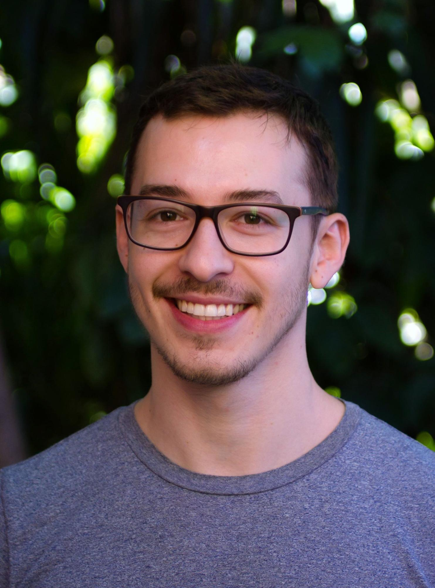 Pietro Pollo (he/him), *School of
Environmental and Life Sciences, University of Newcastle, Newcastle,
Australia; Evolution & Ecology Research Centre, School of Biological,
Earth & Environmental Sciences, University of New South Wales,
Australia* ([Website](http://pietropollo.weebly.com/)

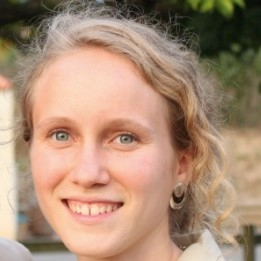 Charlotte Recapet
(they/them), *Université Pau Pays de l'Adour, France*
([Website](https://recherche.univ-pau.fr/en/pagesperso/cv_en_-crecapet-en.html))

 Frigg Speelman (she/her), *Max
Planck Institute for Animal Behaviour, Germany*
([Website](https://fjdspeelman.owlstown.net/))

 Aidan Tan, *Faculty of Medicine and Health,
University of Sydney, Australia*
([Website](https://www.sydney.edu.au/medicine-health/about/our-people/academic-staff/aidan-tan.html))

 Juliette Tariel-Adam
(she/they), Macquarie University, Australia
([Website](https://juliettetarieladam.com)).

     

------------------------------------------------------------------------

### EcoEvoRxiv Committee

[EcoEvoRxiv](https://ecoevorxiv.org/) (EcoEvo"archive") is a
not-for-profit subject-matter specific research repository for works
related to ecology, evolution and conservation and is the official
preprint server of SORTEE.

Current members are:

  
**Chair:** Stefan Vriend (he/him), *Netherlands Institute of Ecology
(NIOO-KNAW), The Netherlands* ([Contact](mailto:svriend@gmail.com) -
[Website](https://nioo.knaw.nl/en/employees/stefan-vriend))

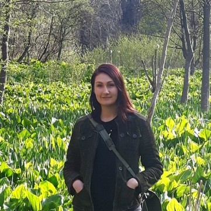 Jenna Braun (she/her) *York University,
Toronto, Canada*

 Corné de Groot, *Ludwig Maximilian University of Munich, Germany*
([Website](https://scholar.google.com/citations?user=eTPSb1IAAAAJ&hl=en))

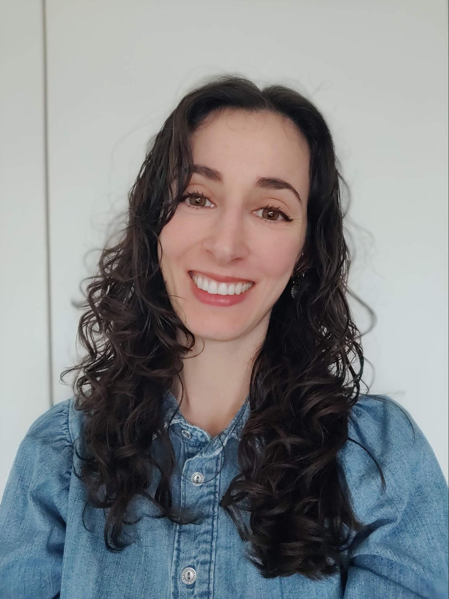 Charlène Gémard (she/her)
*ECoBird, Ghent University, Belgium*
([Website](https://www.linkedin.com/in/charlene-gemard/))

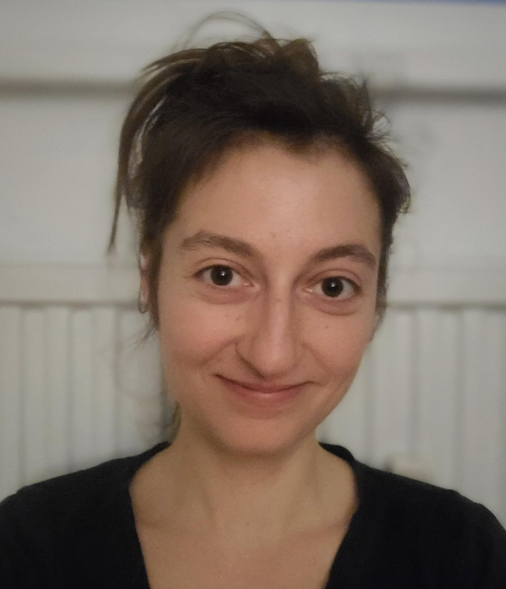 Yseult
Héjja-Brichard (she/they/none), *Department of Interdisciplinary Life
Sciences, University of Veterinary Medicine & Faculty of Life sciences,
University of Vienna, Austria* ([Website](https://yseulthb.github.io/))

 Lise Layotte (she/her), *Norwegian
University of Life Sciences (NMBU), Norway*

 Brooke Long-Fox (she/her),
*MorphoBank, Phoenix Bioinformatics, USA*

 Giulia Masoero (she/her), *Swiss
Ornithological Institute, Sempach, Switzerland*
([Website](https://giuliamasoero.github.io/))

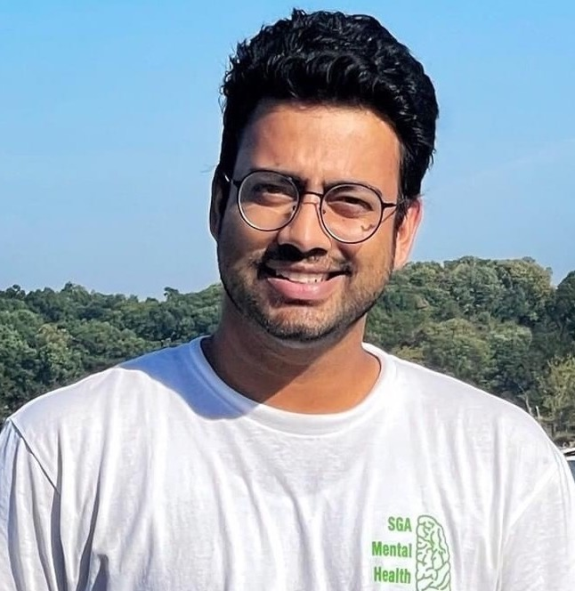 Niladri Mondal (he.him),
*Department of Biology, KU Leuven, Belgium*
([Website](https://niladrimondal.weebly.com/))

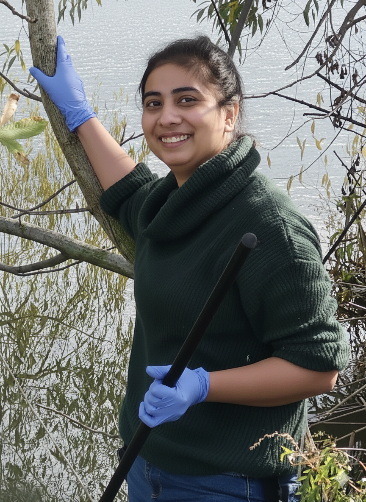 Varsha Rani (she/her), *HUN‐REN Centre
for Ecological Research & Eötvös Loránd University, Budapest, Hungary*
([Website](https://ecolres.hun-ren.hu/en/munkatarsak/varsha-rani/))

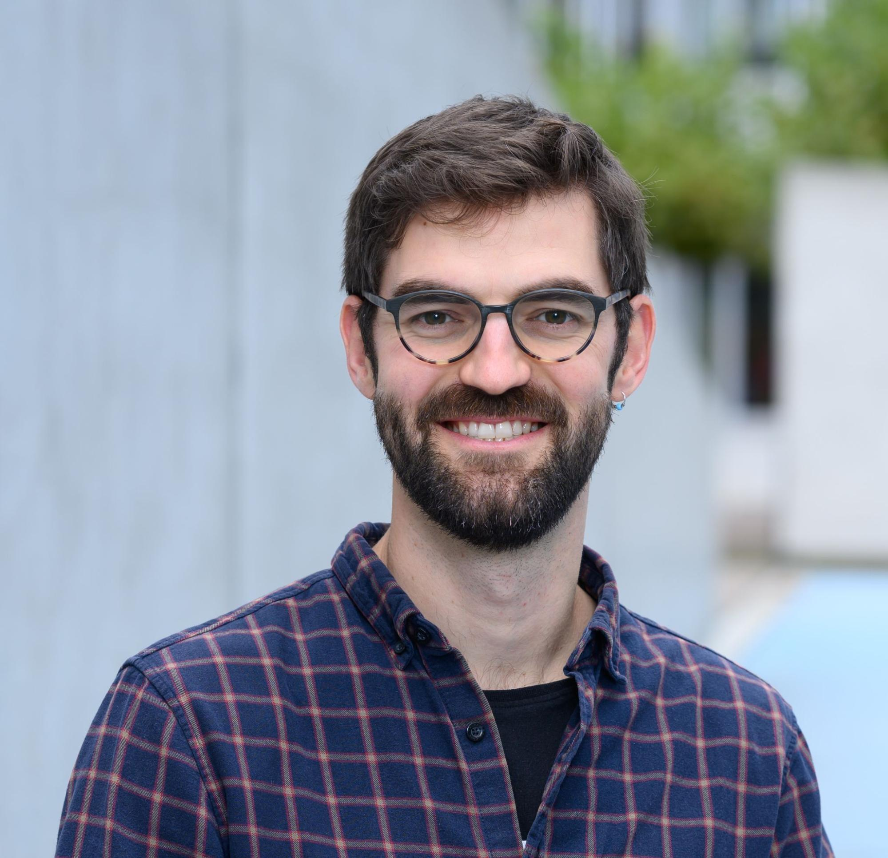 Tom Ratz (he/him), *University of Zurich,
Switzerland* ([Website](http://tomratz.weebly.com))

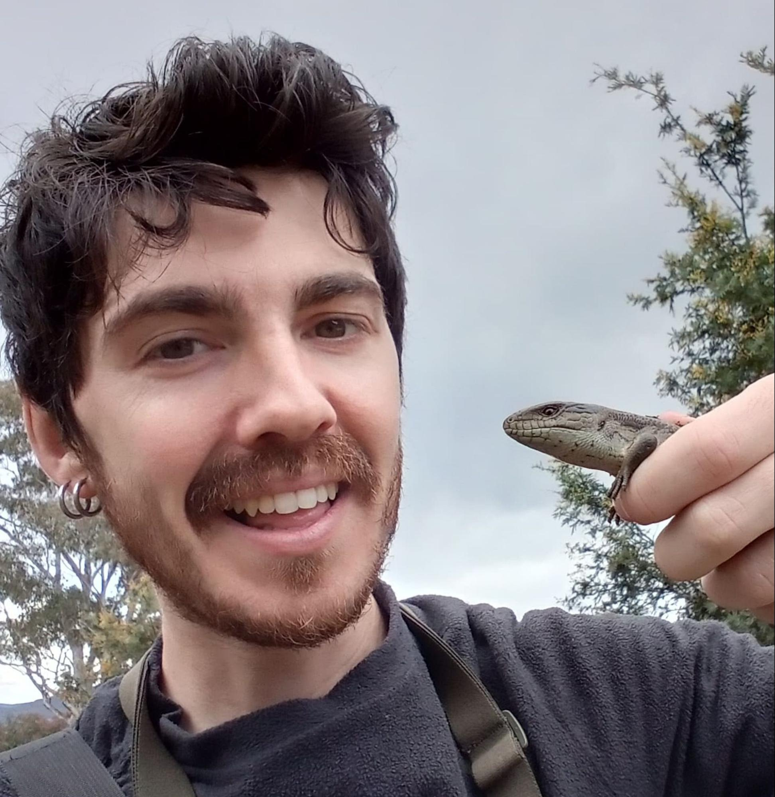 Pablo Recio Santiago
(he/him), *Flinders University, Australia*
([Website](https://www.researchgate.net/profile/Pablo-Recio?ev=hdr_xprf))

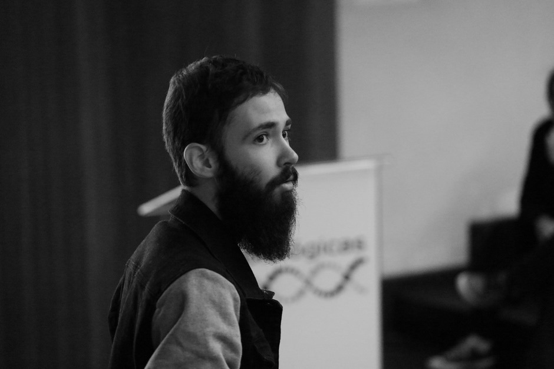 Matheus M. A. Salles
(he/him) *Universidade Federal do Paraná, Brazil*

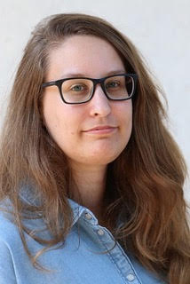 Birgit Szabo (they/them), *Centre for
Research on Ecology, Cognition and Behaviour of Birds (EcoBird),
Department of Biology, Gent University, Belgium*

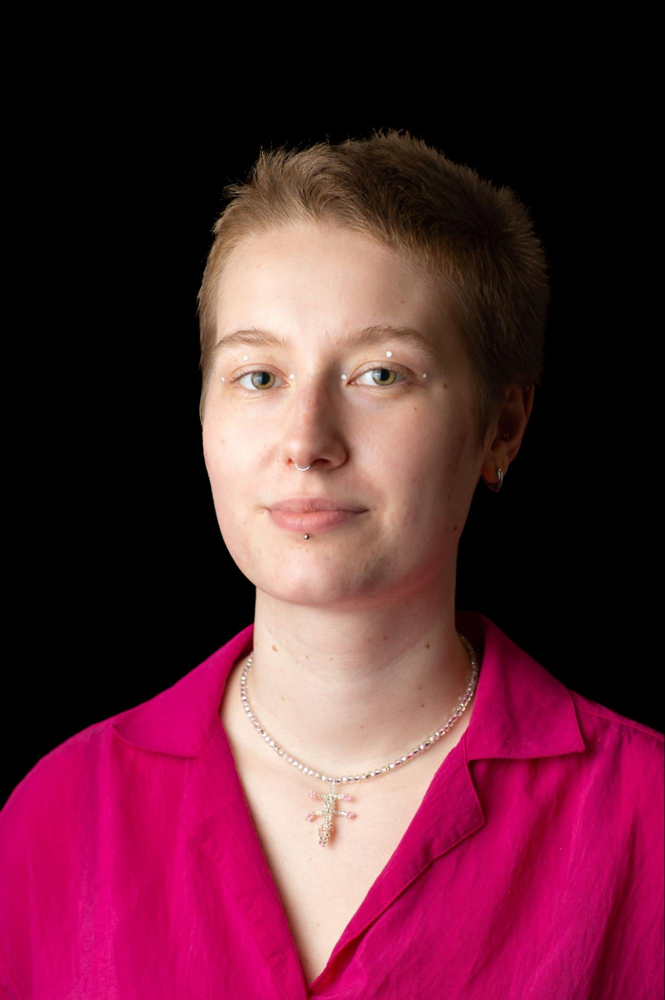 Karolina Wąchała (she/her),
*University of Bern, Switzerland.*
([Website](https://bsky.app/profile/wachalak.bsky.social))

 Mark Young (he/they) *School of Biological
Sciences, University of Southampton, UK*
([Website](https://sites.google.com/view/drmarkyoung))

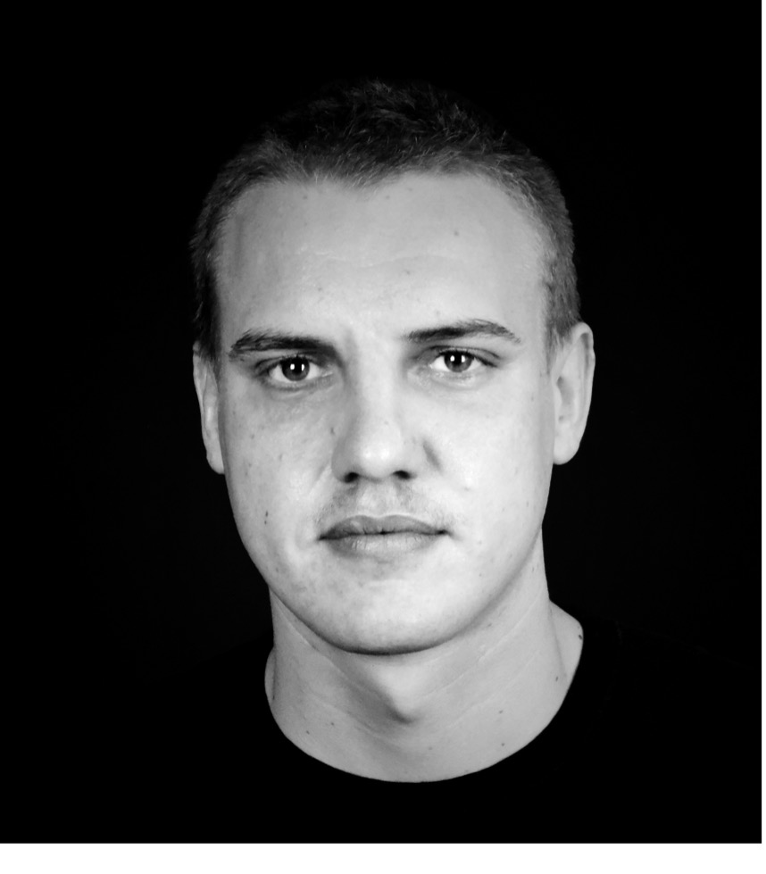 Felix Zimmermann (he/him),
*Swiss Federal Research Institute for Forest, Snow, and Landscape
Research WSL, Birmensdorf, Switzerland*
([Website](https://www.wsl.ch/en/staff/zimmermf/))

     

------------------------------------------------------------------------

### Education and Outreach Committee

The Education & Outreach committee provides educational resources to
individuals and organizations interested in learning more about
improving research by making it more open, reliable, and transparent.

Current members are:

  
**Chair:** Saoirse Kelleher (she/her), *University of Melbourne,
Australia* ([Contact](mailto:saoirse.kelleher@student.unimelb.edu.au) -
[Website](https://saoirsekelleher.eco))

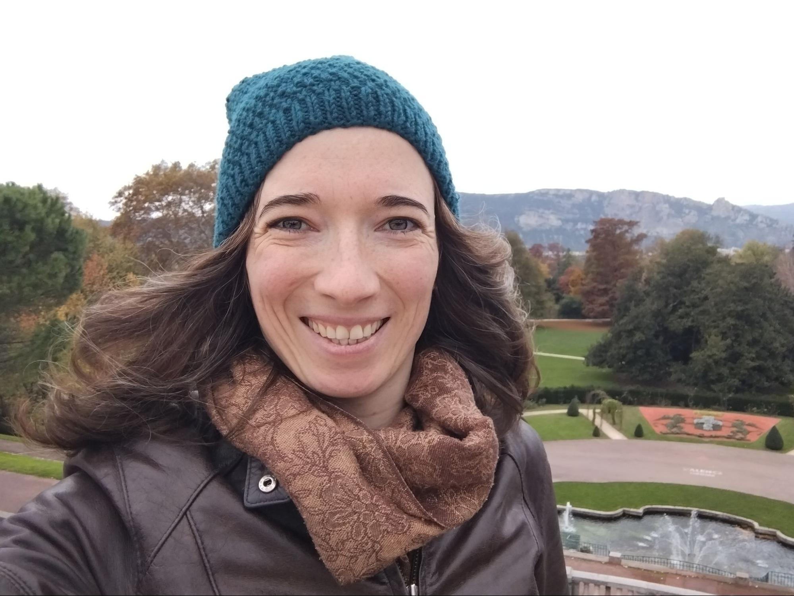 Miriam Beck (she/her) FRB-CESAB
Montpellier, France

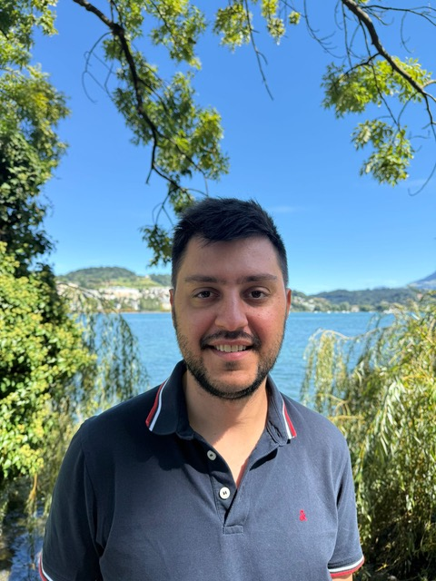 Leonardo Capitani (he/him),
*Eawag - Swiss Federal Institute of Aquatic Science and Technology,
Switzerland* ([Website](https://leomarameo7.github.io/index_home.html)).

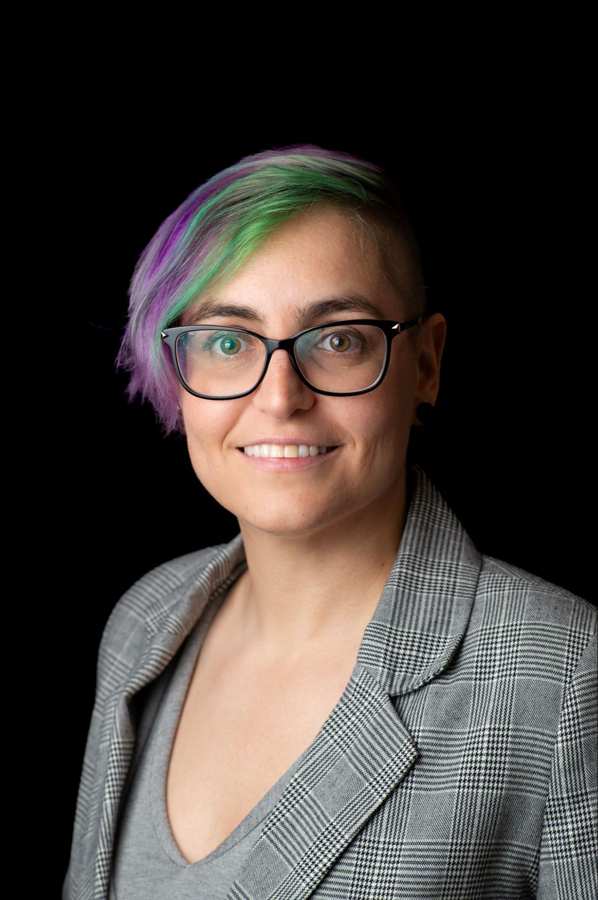 Hermina Ghenu (they/them),
*University of Bern, Switzerland*

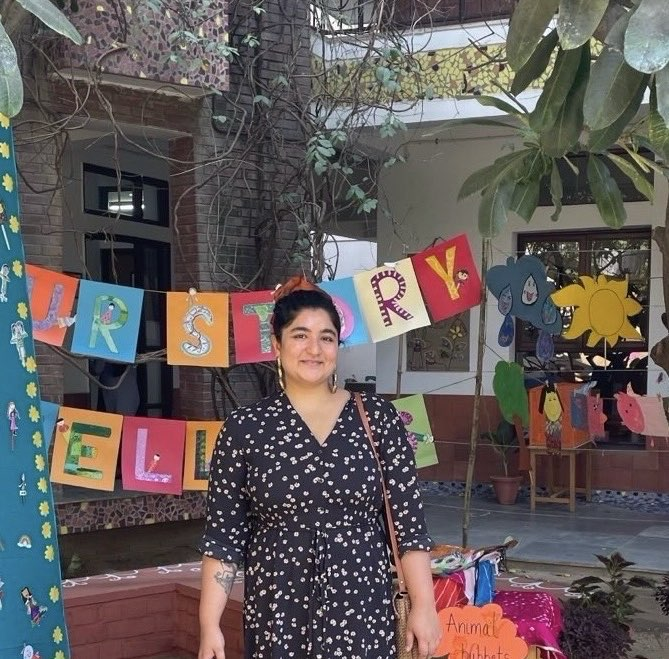 Swastika Issar (she/her),
*National Centre for Biological Sciences, Tata Institute of Fundamental
Research in Bangalore, India*

  
Ineta Kačergytė (she/her) *Swedish University of Agricultural Sciences,
Sweden*
([Website](https://www.slu.se/en/profilepages/k/ineta-kacergyte/))

 César Marín (he/him), *Universidad Santo
Tomás, Chile* ([Website](https://cesar-marin.com/))

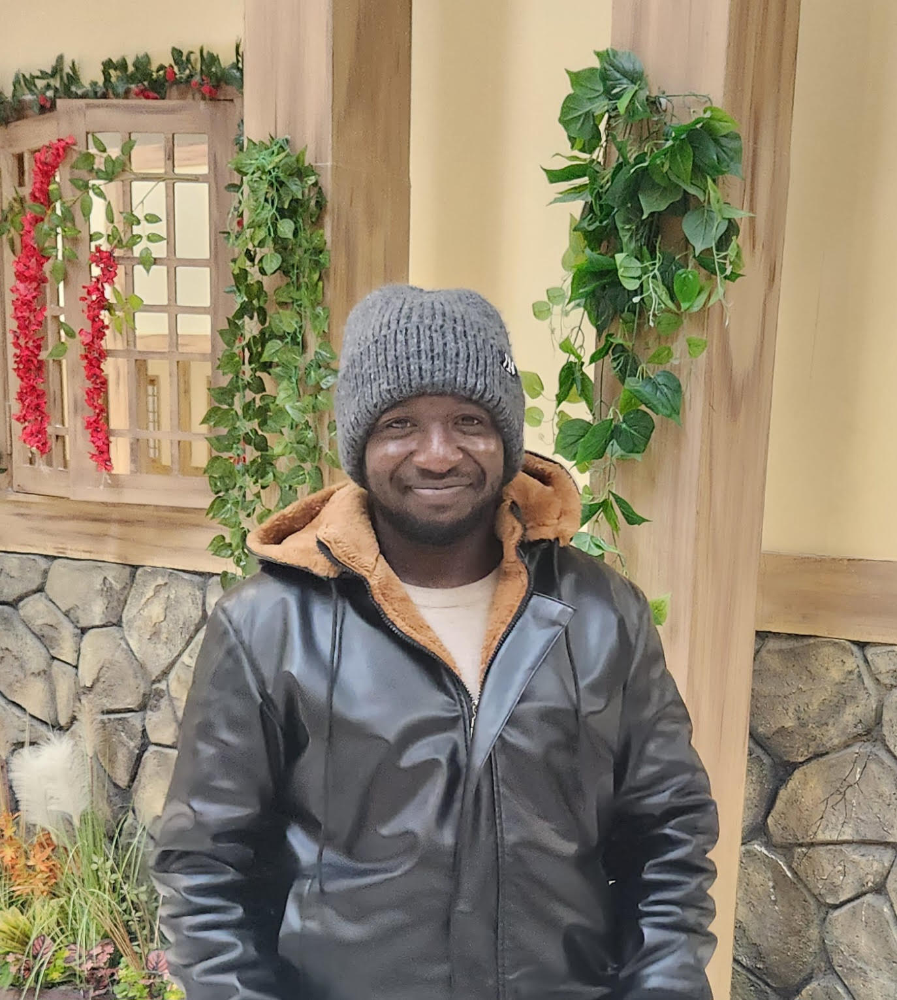 Musa Haladu Ali (he/him),
*Northeast Normal University, Changchun City, China*
([Website](https://ng.linkedin.com/in/musa-haladu-ali-37911716a?trk=people-guest_people_search-card)).

 Luís M. Silva (he/him), *University of
British Columbia, Canada.* ([Website](luis-m-silva.com/)

     

------------------------------------------------------------------------

### Fundraising Committee

The Fundraising committee develops and implements plans for raising
funds to support SORTEE.

Current members are:

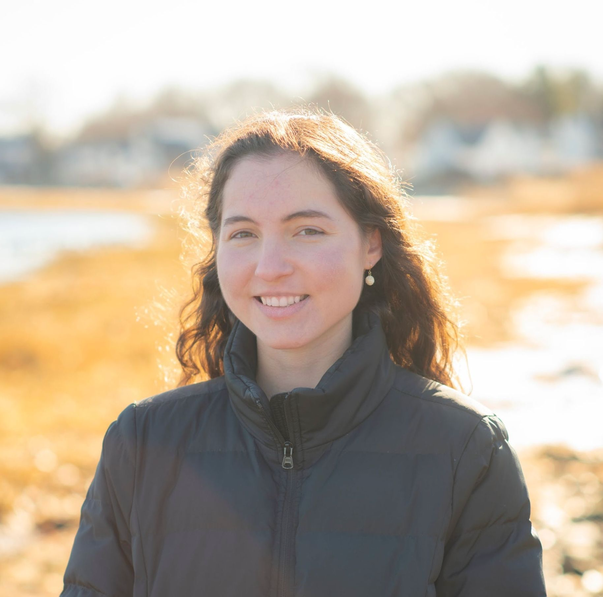
**Chair:** Ruby Krasnow (she/her), *University of Maine, USA*. 
([Website](https://ruby.science))

Michael Bertram (he/him), Swedish University of Agricultural Sciences,
Sweden ([Website](https://www.michaelbertramlab.org))

Barbara Class (she/her), *INRAE, Montpellier, France*
([Website](http://www.barbaraclass.com))

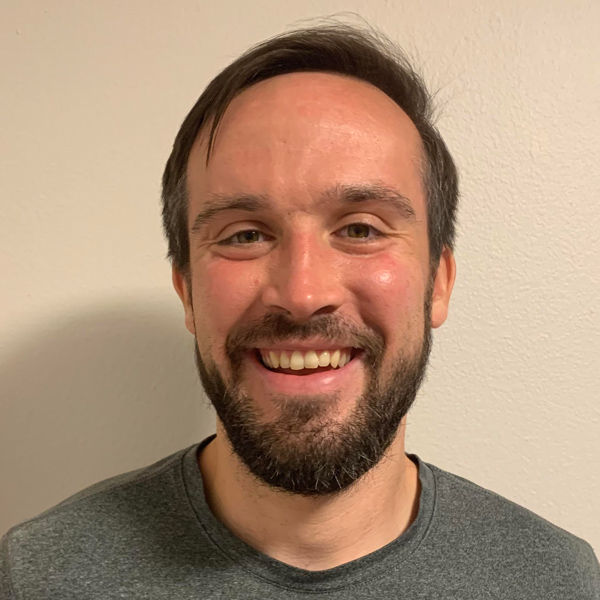
Brian Gallagher (he/him), *Whitman College, USA*. 
[Website](https://scholar.google.com/citations?user=puDZxYgAAAAJ&hl=en&oi=ao)

Malgorzata (Losia) Lagisz (she/her), *University of Alberta, Canada*
([Website](https://mlagisz.weebly.com/) and
[Labwebsite](https://i-deel.org/))

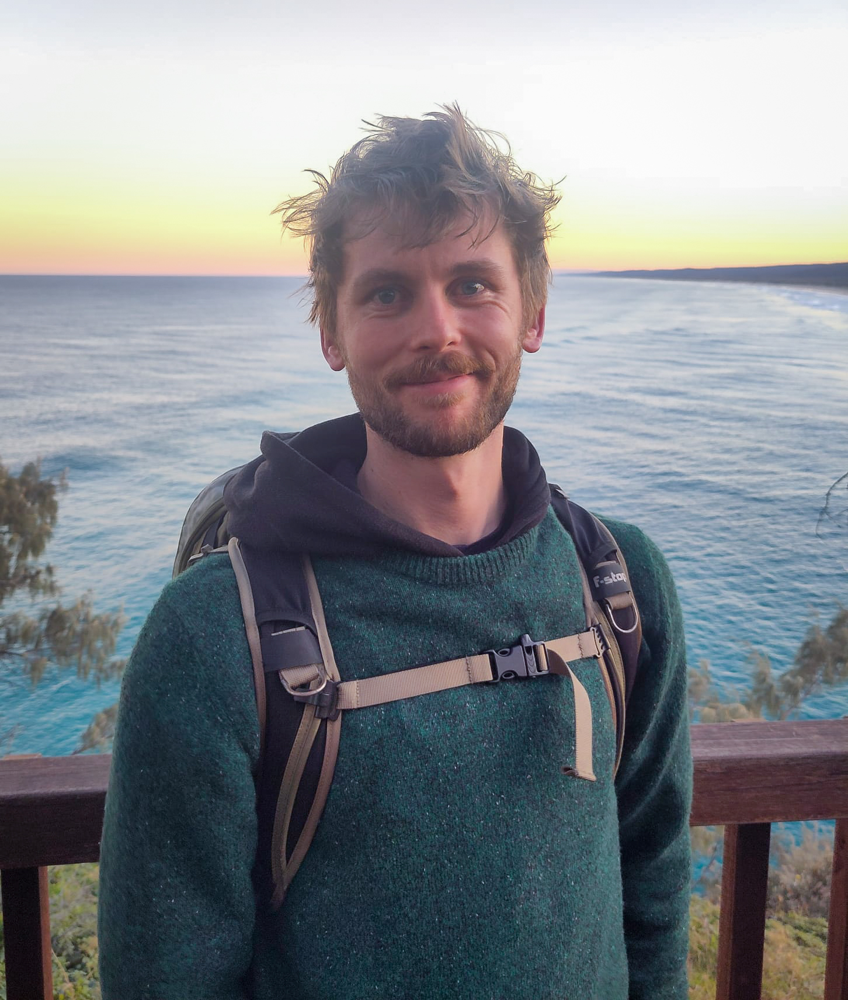
James Orr (he/him), *University of Queensland, Australia*
([Website](https://jamesaorr.github.io/))

Matthieu Paquet (he/him), *Theoretical and Experimental Ecology Station
(SETE), CNRS, France*
([Website](https://sete-moulis-cnrs.fr/fr/recherches/change/equipe/item/1169-paquet-matthieu))

Alfredo Sánchez Tójar (he/him), *University of Coimbra, Portugal*
([Website](https://orcid.org/0000-0002-2886-0649))

Aidan Tan, *Faculty of Medicine and Health, University of Sydney, Australia*
([Website](https://www.sydney.edu.au/medicine-health/about/our-people/academic-staff/aidan-tan.html))

     

------------------------------------------------------------------------

### Media Committee

The Media committee develops content (for the website, social media, and
newsletter), designs and maintains the website, and develops new ideas
for spreading the word about SORTEE and open, reliable, and transparent
science.

Current members are:

**Co-Chair**: Swastika Issar (she/her), *National Centre for Biological Sciences, Tata Institute of Fundamental Research in Bangalore, India*

**Co-Chair**: Oakleigh Wilson (she/her), *University of the Sunshine Coast, Australia* ([Website](https://oakalice.github.io/))

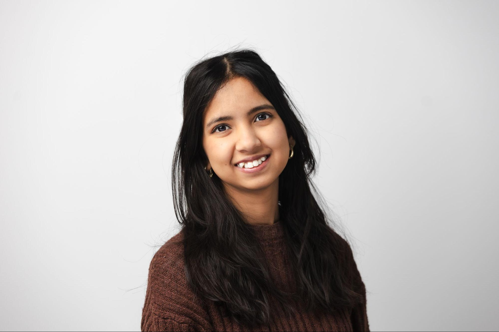
Ipshita Gayen (she/her), *Biological Sciences Department, University of Alberta, Canada*

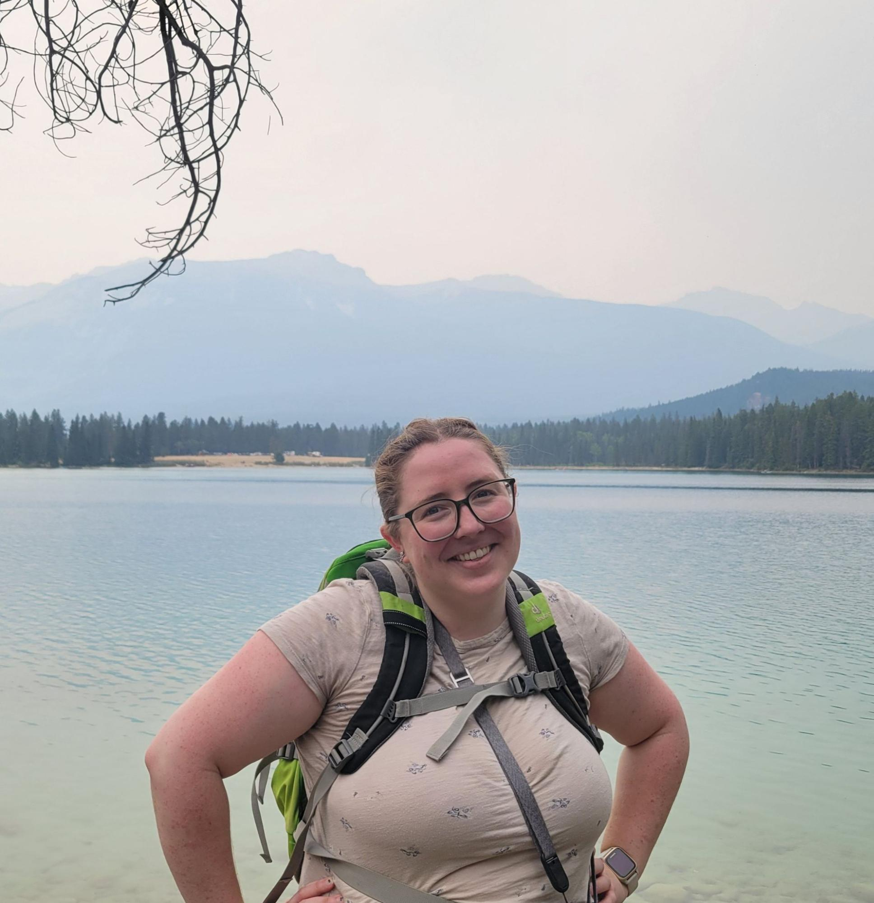
Deborah Hawkshaw (she/her), *Biological Sciences Department, University of Alberta, Canada*

Tim Parker, *Department of biology, Whitman College, USA* 
([Website](http://people.whitman.edu/~parkerth/))

July Pilowsky (they/he/she), *Cary Institute of Ecosystem Studies, USA; Museo de Ciencias Naturales, Spain*

Alfredo Sánchez Tójar (he/him), *University of Coimbra, Portugal*
([Website](https://orcid.org/0000-0002-2886-0649))

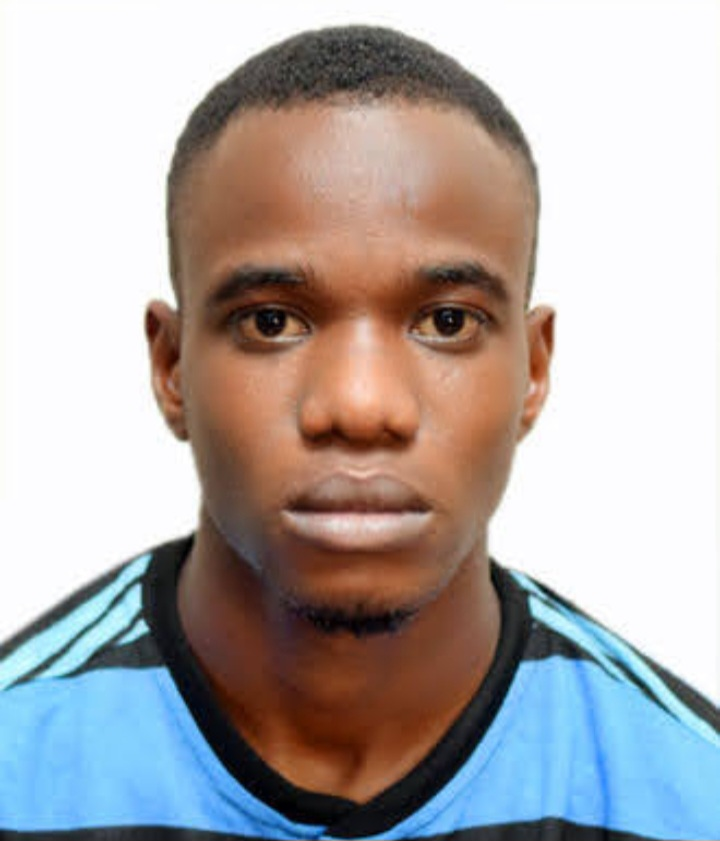
Abdulmalik Usman (he/him) *Department of Wildlife and Ecotourism management, University of Ibadan, Nigeria* 
([Website](https://www.linkedin.com/in/abdulmalik-usman-8b0795271))

 Magdalena Wutkowska
(she/her) *Institute of Soil Biology and Biogeochemistry Biology Centre,
Czech Academy of Sciences, Czechia*

     

------------------------------------------------------------------------

### Member Engagement Committee

The Member Engagement Committee oversees opportunities for SORTEE
members to interact throughout the year. The motivation behind starting
this committee is to increase the benefits of SORTEE membership (e.g.,
camaraderie and the opportunity to join collaborative projects).

Current members are:

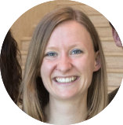
**Chair:** Natalie van Dis, *Netherlands Institute of Ecology (NIOO-KNAW)*
([Contact](mailto:natalie.vandis@helsinki.fi) -
[Website](https://scholar.google.com/citations?user=UTC6iJMAAAAJ&hl=en))

Cecilia Baldoni *Max Planck Institute of Animal Behavior*
([Website](https://cecibaldoni.github.io/))  

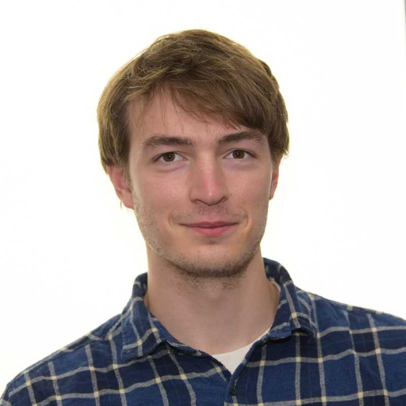
Max Carter-Brown (he/him), *Anglia Ruskin University, UK* 
([Website](https://github.com/Euphrasiologist)) 

Corné de Groot, Ludwig Maximilian University of Munich, Germany ([Website](https://scholar.google.com/citations?user=eTPSb1IAAAAJ&hl=en))

Malgorzata (Losia) Lagisz (she/her), *University of Alberta in Canada*
([Website](https://mlagisz.weebly.com/) and
[Labwebsite](https://i-deel.org/))

Rachel Turba (she/her) *Pontifical Catholic University of Rio Grande do Sul, Brazil*

     

------------------------------------------------------------------------

### Senior Advisory Board

The purpose of the SAB is to provide senior counsel and advice to SORTEE
leadership (Officers, Directors, and Chairs), and to facilitate
strategic connections with related organizations and individuals. The
Terms of Reference for the Senior Advisory Board can be found
[here](https://docs.google.com/document/d/1vCXOde3pGuBl6CJC3LQQ7mehboeb_2SSF-ABTuXxd0M/).

Current members are:

Allen Moore  
Bob Montgomerie  
Bob Wong  
Fiona Fidler  
Julia Koricheva  
Klaus Reinhold  
Mark Burgman  
Michael Jennions  
Nicolas Galtier  
Richard McElreath  
Tracey Chapman  
William Sutherland

     

------------------------------------------------------------------------

### Previous Board Members

Please see [this page]().

 
